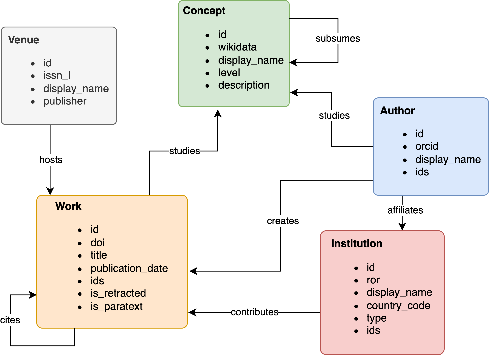

<!-- README.md is generated from README.Rmd. Please edit that file -->

```{r, include = FALSE}
knitr::opts_chunk$set(
  collapse = TRUE,
  comment = "#>",
  fig.path = "man/figures/README-",
  out.width = "100%",
  dpi = 150
)
```

# openalexR 

<!-- badges: start -->

[](https://github.com/ropensci/openalexR/actions/workflows/R-CMD-check.yaml) [](https://lifecycle.r-lib.org/articles/stages.html#experimental) [](https://CRAN.R-project.org/package=openalexR) `r badger::badge_cran_download("openalexR", "grand-total")` [](https://app.codecov.io/gh/ropensci/openalexR?branch=main) [](https://github.com/ropensci/software-review/issues/560)

<!-- badges: end -->

**openalexR** helps you interface with the [OpenAlex](https://openalex.org) API to retrieve bibliographic information about publications, authors, institutions, sources, funders, publishers, topics and concepts with 5 main functions:

-   `oa_fetch`: composes three functions below so the user can execute everything in one step, *i.e.*, `oa_query |> oa_request |> oa2df`

-   `oa_query`: generates a valid query, written following the OpenAlex API syntax, from a set of arguments provided by the user.

-   `oa_request`: downloads a collection of entities matching the query created by `oa_query` or manually written by the user, and returns a JSON object in a list format.

-   `oa2df`: converts the JSON object in classical bibliographic tibble/data frame.

-   `oa_random`: get random entity, *e.g.*, `oa_random("works")` gives a different work each time you run it

## 🙌 Support OpenAlex

If OpenAlex has helped you, consider writing a [Testimonial](https://forms.monday.com/forms/4d5ad5a8e6a72ae31987a29118f1d437?r=use1) which will help support the OpenAlex team and show that their work is making a *real and necessary* impact.

## ⚙️ Setup

You can install the developer version of openalexR from [GitHub](https://github.com) with:

```{r eval=FALSE}
install.packages("remotes")
remotes::install_github("ropensci/openalexR")
```

You can install the released version of openalexR from [CRAN](https://CRAN.R-project.org) with:

```{r eval=FALSE}
install.packages("openalexR")
```

Before we go any further, we highly recommend you set `openalexR.mailto` option so that your requests go to [the polite pool](https://docs.openalex.org/how-to-use-the-api/rate-limits-and-authentication#the-polite-pool) for faster response times.
If you have OpenAlex Premium, you can add your API key to the `openalexR.apikey` option as well.
These lines best go into `.Rprofile` with `file.edit("~/.Rprofile")`.

```{r eval=FALSE}
options(openalexR.mailto = "example@email.com")
options(openalexR.apikey = "EXAMPLE_APIKEY")
```

Alternatively, you can open `.Renviron` with `file.edit("~/.Renviron")` and add:
```
openalexR.mailto = example@email.com
openalexR.apikey = EXAMPLE_APIKEY
```

```{r warning=FALSE, message=FALSE}
library(openalexR)
library(dplyr)
library(ggplot2)
```

```{r set-theme, include=FALSE}
theme_set(theme_classic())
theme_update(
  plot.background = element_rect(fill = "transparent", colour = NA),
  panel.background = element_rect(fill = "transparent", colour = NA)
)

knitr::opts_chunk$set(dev.args = list(bg = "transparent"))
```

## 🌿 Examples

There are different [filters](https://ropensci.github.io/openalexR/articles/Filters)/arguments you can use in `oa_fetch`, depending on which [entity](https://docs.openalex.org/#data) you're interested in: works, authors, sources, funders, institutions, or concepts. We show a few examples below.

### 📚 Works

**Goal**: Download all information about a givens set of publications (known DOIs).

Use `doi` as a [works filter](https://ropensci.github.io/openalexR/articles/Filters.html#works):

```{r}
works_from_dois <- oa_fetch(
  entity = "works",
  doi = c("10.1016/j.joi.2017.08.007", "https://doi.org/10.1007/s11192-013-1221-3"),
  verbose = TRUE
)
```

We can view the output tibble/dataframe, `works_from_dois`, interactively in RStudio or inspect it with base functions like `str` or `head`. We also provide the experimental `show_works` function to simplify the result (e.g., remove some columns, keep first/last author) for easy viewing.

*Note*: the following table is wrapped in `knitr::kable()` to be displayed nicely in this README, but you will most likely not need this function.

```{r}
# str(works_from_dois, max.level = 2)
# head(works_from_dois)
# show_works(works_from_dois)

works_from_dois |>
  show_works() |>
  knitr::kable()
```

**Goal**: Download all works published by a set of authors (known ORCIDs).

Use `author.orcid` as a filter (either canonical form with <https://orcid.org/> or without will work):

```{r}
works_from_orcids <- oa_fetch(
  entity = "works",
  author.orcid = c("0000-0001-6187-6610", "0000-0002-8517-9411"),
  verbose = TRUE
)

works_from_orcids |>
  show_works() |>
  knitr::kable()
```

**Goal**: Download all works that have been cited more than 50 times, published between 2020 and 2021, and include the strings "bibliometric analysis" or "science mapping" in the title. Maybe we also want the results to be sorted by total citations in a descending order.

```{r}
works_search <- oa_fetch(
  entity = "works",
  title.search = c("bibliometric analysis", "science mapping"),
  cited_by_count = ">50",
  from_publication_date = "2020-01-01",
  to_publication_date = "2021-12-31",
  options = list(sort = "cited_by_count:desc"),
  verbose = TRUE
)

works_search |>
  show_works() |>
  knitr::kable()
```

### 🧑 Authors

**Goal**: Download author information when we know their ORCID.

Here, instead of `author.orcid` like earlier, we have to use `orcid` as an argument. This may be a little confusing, but again, a different entity (**authors** instead of **works**) requires a [different set of filters](https://ropensci.github.io/openalexR/articles/Filters.html#authors).

```{r}
authors_from_orcids <- oa_fetch(
  entity = "authors",
  orcid = c("0000-0001-6187-6610", "0000-0002-8517-9411")
)

authors_from_orcids |>
  show_authors() |>
  knitr::kable()
```

**Goal**: Acquire information on the authors of this package.

We can use other filters such as `display_name` and `has_orcid`:

```{r}
authors_from_names <- oa_fetch(
  entity = "authors",
  display_name = c("Massimo Aria", "Jason Priem"),
  has_orcid = TRUE
)
authors_from_names |>
  show_authors() |>
  knitr::kable()
```

**Goal**: Download all authors' records of scholars who work at the [University of Naples Federico II](https://explore.openalex.org/institutions/I71267560) (OpenAlex ID: I71267560) and have published at least 500 publications.

Let's first check how many records match the query, then download the entire collection. We can do this by first defining a list of arguments, then adding `count_only` (default `FALSE`) to this list:

```{r}
my_arguments <- list(
  entity = "authors",
  last_known_institutions.id = "I71267560",
  works_count = ">499"
)

do.call(oa_fetch, c(my_arguments, list(count_only = TRUE)))

if (do.call(oa_fetch, c(my_arguments, list(count_only = TRUE)))[1]>0){
do.call(oa_fetch, my_arguments) |>
  show_authors() |>
  knitr::kable()
}
```

## 🍒 Example analyses

**Goal**: track the popularity of *Biology* concepts over time.

We first download the records of all level-1 concepts/keywords that concern over one million works:

```{r biological-concepts}
library(gghighlight)
concept_df <- oa_fetch(
  entity = "concepts",
  level = 1,
  ancestors.id = "https://openalex.org/C86803240", # Biology
  works_count = ">1000000"
)

concept_df |>
  select(display_name, counts_by_year) |>
  tidyr::unnest(counts_by_year) |>
  filter(year < 2022) |>
  ggplot() +
  aes(x = year, y = works_count, color = display_name) +
  facet_wrap(~display_name) +
  geom_line(linewidth = 0.7) +
  scale_color_brewer(palette = "Dark2") +
  labs(
    x = NULL, y = "Works count",
    title = "Virology spiked in 2020."
  ) +
  guides(color = "none") +
  gghighlight(
    max(works_count) > 200000,
    min(works_count) < 400000,
    label_params = list(nudge_y = 10^5, segment.color = NA)
  )
```

**Goal**: Rank institutions in Italy by total number of citations.

We want download all records regarding Italian institutions (country_code:it) that are classified as educational (type:education). Again, we check how many records match the query then download the collection:

```{r italy-insts, fig.height=3.5, fig.width=7}
italy_insts <- oa_fetch(
  entity = "institutions",
  country_code = "it",
  type = "education",
  verbose = TRUE
)

italy_insts |>
  slice_max(cited_by_count, n = 8) |>
  mutate(display_name = forcats::fct_reorder(display_name, cited_by_count)) |>
  ggplot() +
  aes(x = cited_by_count, y = display_name, fill = display_name) +
  geom_col() +
  scale_fill_viridis_d(option = "E") +
  guides(fill = "none") +
  labs(
    x = "Total citations", y = NULL,
    title = "Italian references"
  ) +
  coord_cartesian(expand = FALSE)
```

And what do they publish on?

```{r concept-cloud, fig.height=5, fig.width=7}
# The package wordcloud needs to be installed to run this chunk
# library(wordcloud)

concept_cloud <- italy_insts |>
  select(inst_id = id, x_concepts) |>
  tidyr::unnest(x_concepts) |>
  filter(level == 1) |>
  select(display_name, score) |>
  group_by(display_name) |>
  summarise(score = sum(score))

pal <- c("black", scales::brewer_pal(palette = "Set1")(5))
set.seed(1)
wordcloud::wordcloud(
  concept_cloud$display_name,
  concept_cloud$score,
  scale = c(2, .4),
  colors = pal
)
```

**Goal**: Visualize big journals' topics.

We first download all records regarding journals that have published more than 300,000 works, then visualize their scored concepts:

```{r big-journals, message=FALSE, fig.height=8, fig.width=8}
# The package ggtext needs to be installed to run this chunk
# library(ggtext)

jours_all <- oa_fetch(
  entity = "sources",
  works_count = ">200000",
  verbose = TRUE
)

jours <- jours_all |>
  filter(!is.na(x_concepts), type != "ebook platform") |>
  slice_max(cited_by_count, n = 9) |>
  distinct(display_name, .keep_all = TRUE) |>
  select(jour = display_name, x_concepts) |>
  tidyr::unnest(x_concepts) |>
  filter(level == 0) |>
  left_join(concept_abbrev, by = join_by(id, display_name)) |>
  mutate(
    abbreviation = gsub(" ", "<br>", abbreviation),
    jour = gsub("Journal of|Journal of the", "J.", gsub("\\(.*?\\)", "", jour))
  ) |>
  tidyr::complete(jour, abbreviation, fill = list(score = 0)) |>
  group_by(jour) |>
  mutate(
    color = if_else(score > 10, "#1A1A1A", "#D9D9D9"), # CCCCCC
    label = paste0("<span style='color:", color, "'>", abbreviation, "</span>")
  ) |>
  ungroup()

jours |>
  ggplot() +
  aes(fill = jour, y = score, x = abbreviation, group = jour) +
  facet_wrap(~jour) +
  geom_hline(yintercept = c(45, 90), colour = "grey90", linewidth = 0.2) +
  geom_segment(
    aes(x = abbreviation, xend = abbreviation, y = 0, yend = 100),
    color = "grey95"
  ) +
  geom_col(color = "grey20") +
  coord_polar(clip = "off") +
  theme_bw() +
  theme(
    plot.background = element_rect(fill = "transparent", colour = NA),
    panel.background = element_rect(fill = "transparent", colour = NA),
    panel.grid = element_blank(),
    panel.border = element_blank(),
    axis.text = element_blank(),
    axis.ticks.y = element_blank()
  ) +
  ggtext::geom_richtext(
    aes(y = 120, label = label),
    fill = NA, label.color = NA, size = 3
  ) +
  scale_fill_brewer(palette = "Set1", guide = "none") +
  labs(y = NULL, x = NULL, title = "Journal clocks")
```

## ❄️ Snowball search

The user can also perform *snowballing* with `oa_snowball`. Snowballing is a literature search technique where the researcher starts with a set of articles and find articles that cite or were cited by the original set. `oa_snowball` returns a list of 2 elements: *nodes* and *edges*. Similar to `oa_fetch`, `oa_snowball` finds and returns information on a core set of articles satisfying certain criteria, but, unlike `oa_fetch`, it also returns information the articles that cite and are cited by this core set.

```{r snowballing}
# The packages ggraph and tidygraph need to be installed to run this chunk
library(ggraph)
library(tidygraph)

snowball_docs <- oa_snowball(
  identifier = c("W1964141474", "W1963991285"),
  verbose = TRUE
)

ggraph(graph = as_tbl_graph(snowball_docs), layout = "stress") +
  geom_edge_link(aes(alpha = after_stat(index)), show.legend = FALSE) +
  geom_node_point(aes(fill = oa_input, size = cited_by_count), shape = 21, color = "white") +
  geom_node_label(aes(filter = oa_input, label = id), nudge_y = 0.2, size = 3) +
  scale_edge_width(range = c(0.1, 1.5), guide = "none") +
  scale_size(range = c(3, 10), guide = "none") +
  scale_fill_manual(values = c("#a3ad62", "#d46780"), na.value = "grey", name = "") +
  theme_graph() +
  theme(
    plot.background = element_rect(fill = "transparent", colour = NA),
    panel.background = element_rect(fill = "transparent", colour = NA),
    legend.position = "bottom"
  ) +
  guides(fill = "none")
```

## 🌾 N-grams

OpenAlex offers (limited) support for [fulltext N-grams](https://docs.openalex.org/api-entities/works/get-n-grams#fulltext-coverage) of Work entities (these have IDs starting with `"W"`). Given a vector of work IDs, `oa_ngrams` returns a dataframe of N-gram data (in the `ngrams` list-column) for each work.

```{r ngrams, fig.height=3}
ngrams_data <- oa_ngrams(
  works_identifier = c("W1964141474", "W1963991285"),
  verbose = TRUE
)

ngrams_data

lapply(ngrams_data$ngrams, head, 3)

ngrams_data |>
  tidyr::unnest(ngrams) |>
  filter(ngram_tokens == 2) |>
  select(id, ngram, ngram_count) |>
  group_by(id) |>
  slice_max(ngram_count, n = 10, with_ties = FALSE) |>
  ggplot(aes(ngram_count, forcats::fct_reorder(ngram, ngram_count))) +
  geom_col(aes(fill = id), show.legend = FALSE) +
  facet_wrap(~id, scales = "free_y") +
  labs(
    title = "Top 10 fulltext bigrams",
    x = "Count",
    y = NULL
  )
```

`oa_ngrams` can sometimes be slow because the N-grams data can get pretty big, but given that the N-grams are `"cached via CDN"`](<https://docs.openalex.org/api-entities/works/get-n-grams#api-endpoint>), you may also consider parallelizing for this special case (`oa_ngrams` does this automatically if you have `{curl} >= v5.0.0`).

## 💫 About OpenAlex



::: {style="text-align: right"}
Schema credits: [\@dhimmel](https://github.com/dhimmel)
:::

[OpenAlex](https://openalex.org) is a fully open catalog of the global research system. It's named after the ancient [Library of Alexandria](https://en.wikipedia.org/wiki/Library_of_Alexandria). The OpenAlex dataset describes scholarly entities and how those entities are connected to each other. There are five types of entities:

-   **Works** are papers, books, datasets, etc; they cite other works

-   **Authors** are people who create works

-   **Sources** are journals and repositories that host works

-   **Institutions** are universities and other orgs that are affiliated with works (via authors)

-   **Concepts** *tag* Works with a topic

## 🤝 Code of Conduct

Please note that this package is released with a [Contributor Code of Conduct](https://ropensci.org/code-of-conduct/). By contributing to this project, you agree to abide by its terms.

## 👓 Acknowledgements

Package hex was made with [Midjourney](https://www.midjourney.com/home/) and thus inherits a [CC BY-NC 4.0 license](https://creativecommons.org/licenses/by-nc/4.0/legalcode).
