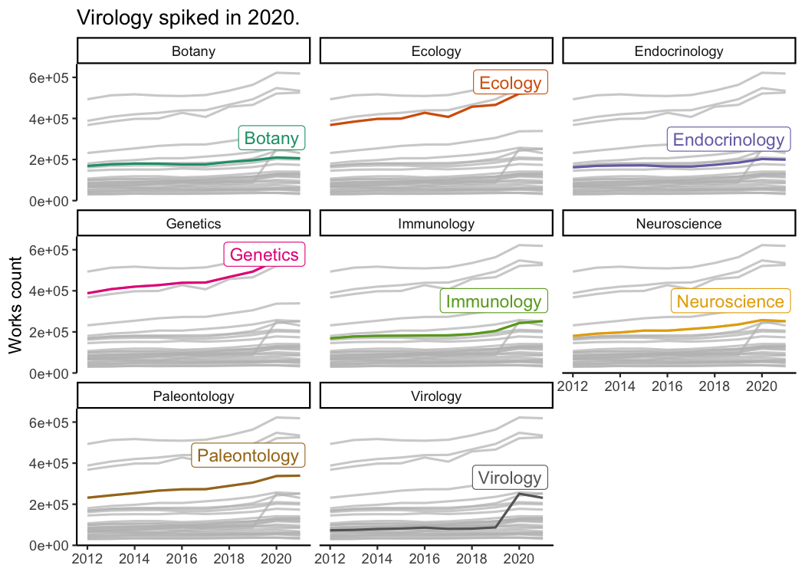
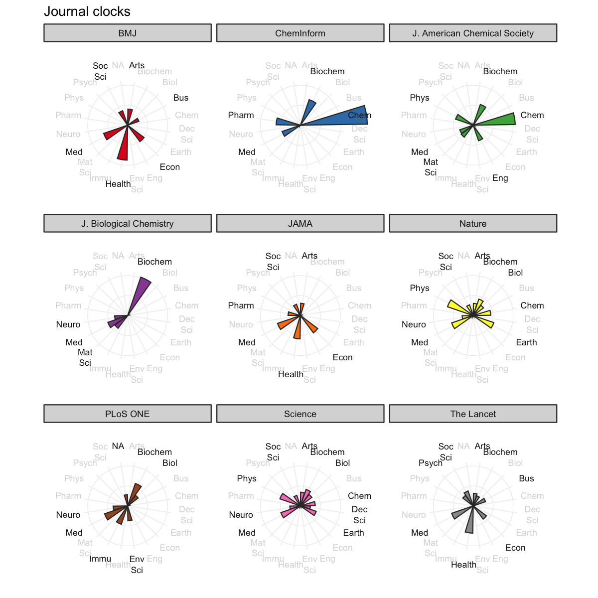

<!-- README.md is generated from README.Rmd. Please edit that file -->

# openalexR 

<!-- badges: start -->

[](https://github.com/massimoaria/openalexR/actions/workflows/R-CMD-check.yaml)
[](https://cran.r-project.org/package=openalexR)
[](https://CRAN.R-project.org/package=openalexR)
[](https://lifecycle.r-lib.org/articles/stages.html#experimental)

<!-- badges: end -->

**openalexR** helps you interface with the
[OpenAlex](https://openalex.org) API to retrieve bibliographic
infomation about publications, authors, venues, institutions and
concepts with 5 main functions:

-   `oa_fetch()`: composes three functions below so the user can execute
    everything in one step, *i.e.*, `oa_query |> oa_request |> oa2df`

-   `oa_query()`: generates a valid query, written following the
    OpenAlex API syntax, from a set of arguments provided by the user.

-   `oa_request()`: downloads a collection of entities matching the
    query created by `oa_query()` or manually written by the user, and
    returns a JSON object in a list format.

-   `oa2df()`: converts the JSON object in classical bibliographic
    tibble/data frame.

-   `oa_random()`: to get random entity, e.g., `oa_random("works")`
    gives a different work each time you run it

## Setup

You can install the developer version of the openalexR from
[GitHub](https://github.com) with:

``` r
install.packages("remotes")
remotes::install_github("massimoaria/openalexR")
```

You can install the released version of openalexR from
[CRAN](https://CRAN.R-project.org) with:

``` r
install.packages("openalexR")
```

Before we go any further, we highly recommend you set `openalexR.mailto`
option so that your requests go to [the polite
pool](https://docs.openalex.org/api#the-polite-pool) for faster response
times:

``` r
options(openalexR.mailto = "example@email.com")
```

Bonus point if you put this in your `.Rprofile` with
`usethis::edit_r_profile()`.

``` r
library(openalexR)
library(dplyr)
library(ggplot2)
theme_set(theme_classic())
```

## Examples

There are different
[filters](https://docs.openalex.org/api/get-lists-of-entities/filter-entity-lists)/arguments
you can use in `oa_fetch`, depending on which
[entity](https://docs.openalex.org/about-the-data) you’re interested in:
works, authors, venues, institutions, or concepts. We show a few
examples before.

### Works

**Goal**: Download all information about certain publications (given
DOIs).

Use `doi` as a [**works**
filter](https://docs.openalex.org/api/get-lists-of-entities/filter-entity-lists#works-filters)
(either the canonical form with <https://doi.org/> or without):

``` r
oa_fetch(
  doi = c("10.1016/j.joi.2017.08.007", "https://doi.org/10.1093/bioinformatics/btab727"),
  entity = "works",
  verbose = TRUE
) %>% 
  show_works() %>%
  knitr::kable()
#> Requesting url: https://api.openalex.org/works?filter=doi%3A10.1016%2Fj.joi.2017.08.007%7Chttps%3A%2F%2Fdoi.org%2F10.1093%2Fbioinformatics%2Fbtab727
#> About to get a total of 1 pages of results with a total of 2 records.
```

| short_id    | display_name                                                                           | first_author     | last_author        | so                      | url                                              | is_oa | top_concepts                                                       |
|:------------|:---------------------------------------------------------------------------------------|:-----------------|:-------------------|:------------------------|:-------------------------------------------------|:------|:-------------------------------------------------------------------|
| W2755950973 | bibliometrix : An R-tool for comprehensive science mapping analysis                    | Massimo Aria     | Corrado Cuccurullo | Journal of Informetrics | <https://doi.org/10.1016/j.joi.2017.08.007>      | FALSE | Data science, Information retrieval                                |
| W3206431085 | PMLB v1.0: an open-source dataset collection for benchmarking machine learning methods | Joseph D. Romano | Jason H. Moore     | Bioinformatics          | <https://doi.org/10.1093/bioinformatics/btab727> | TRUE  | Benchmarking, Python (programming language), Benchmark (surveying) |

**Goal**: Download all works published by a set of authors (given
ORCIDs).

Use `author.orcid` as a filter (for now, we need to provide the
canonical form with <https://orcid.org/>):

``` r
orcids <- c("0000-0003-3737-6565", "0000-0002-8517-9411")
canonical_orcids <- paste0("https://orcid.org/", orcids)
oa_fetch(
  entity = "works",
  author.orcid = canonical_orcids,
  verbose = TRUE
) %>% 
  show_works() %>% 
  knitr::kable()
#> Requesting url: https://api.openalex.org/works?filter=author.orcid%3Ahttps%3A%2F%2Forcid.org%2F0000-0003-3737-6565%7Chttps%3A%2F%2Forcid.org%2F0000-0002-8517-9411
#> About to get a total of 2 pages of results with a total of 211 records.
```

| short_id    | display_name                                                                                                                              | first_author          | last_author         | so                              | url                                             | is_oa | top_concepts                                                |
|:------------|:------------------------------------------------------------------------------------------------------------------------------------------|:----------------------|:--------------------|:--------------------------------|:------------------------------------------------|:------|:------------------------------------------------------------|
| W2755950973 | bibliometrix : An R-tool for comprehensive science mapping analysis                                                                       | Massimo Aria          | Corrado Cuccurullo  | Journal of Informetrics         | <https://doi.org/10.1016/j.joi.2017.08.007>     | FALSE | Data science, Information retrieval                         |
| W2955219525 | Scaling tree-based automated machine learning to biomedical big data with a feature set selector                                          | Trang T. Le           | Jason H. Moore      | Bioinformatics                  | <https://doi.org/10.1093/bioinformatics/btz470> | TRUE  | Pipeline (software), Scalability, Feature (linguistics)     |
| W1979874437 | Analysis of powered two-wheeler crashes in Italy by classification trees and rules discovery                                              | Alfonso Montella      | Filomena Mauriello  | Accident Analysis & Prevention  | <https://doi.org/10.1016/j.aap.2011.04.025>     | FALSE | Crash, Identification (biology), Decision tree              |
| W2952824318 | A Nonlinear Simulation Framework Supports Adjusting for Age When Analyzing BrainAGE                                                       | Trang T. Le           | Tulsa Investigators | Frontiers in Aging Neuroscience | <https://doi.org/10.3389/fnagi.2018.00317>      | TRUE  | Correlation, Mood, Contrast (vision)                        |
| W2408216567 | Foundations and trends in performance management. A twenty-five years bibliometric analysis in business and public administration domains | Corrado Cuccurullo    | Fabrizia Sarto      | Scientometrics                  | <https://doi.org/10.1007/s11192-016-1948-8>     | FALSE | Administration (probate law), Bibliometrics, Trend analysis |
| W2281330131 | Coopetition and sustainable competitive advantage. The case of tourist destinations                                                       | Valentina Della Corte | Massimo Aria        | Tourism Management              | <https://doi.org/10.1016/j.tourman.2015.12.009> | FALSE | Competitive advantage, Tourism                              |

**Goal**: Download all works that have been cited more than 50 times,
published between 2020 and 2021, and include the strings “bibliometric
analysis” or “science mapping” in the title. Maybe we also want the
results to be sorted by total citations in a descending order.

``` r
oa_fetch(
  entity = "works",
  title.search = c("bibliometric analysis", "science mapping"),
  cited_by_count = ">50", 
  from_publication_date = "2020-01-01",
  to_publication_date = "2021-12-31",
  sort = "cited_by_count:desc",
  verbose = TRUE
) %>%
  show_works() %>%
  knitr::kable()
#> Requesting url: https://api.openalex.org/works?filter=title.search%3Abibliometric%20analysis%7Cscience%20mapping%2Ccited_by_count%3A%3E50%2Cfrom_publication_date%3A2020-01-01%2Cto_publication_date%3A2021-12-31&sort=cited_by_count%3Adesc
#> About to get a total of 1 pages of results with a total of 33 records.
```

| short_id    | display_name                                                                                                                  | first_author        | last_author        | so                                        | url                                             | is_oa | top_concepts                                                  |
|:------------|:------------------------------------------------------------------------------------------------------------------------------|:--------------------|:-------------------|:------------------------------------------|:------------------------------------------------|:------|:--------------------------------------------------------------|
| W3160856016 | How to conduct a bibliometric analysis: An overview and guidelines                                                            | Naveen Donthu       | Weng Marc Lim      | Journal of Business Research              | <https://doi.org/10.1016/j.jbusres.2021.04.070> | TRUE  | Bibliometrics, Field (mathematics), Resource (disambiguation) |
| W3038273726 | Investigating the emerging COVID-19 research trends in the field of business and management: A bibliometric analysis approach | Surabhi Verma       | Anders Gustafsson  | Journal of Business Research              | <https://doi.org/10.1016/j.jbusres.2020.06.057> | TRUE  | Bibliometrics, Field (mathematics), MEDLINE                   |
| W2990450011 | Forty-five years of Journal of Business Research: A bibliometric analysis                                                     | Naveen Donthu       | Debidutta Pattnaik | Journal of Business Research              | <https://doi.org/10.1016/j.jbusres.2019.10.039> | FALSE | Bibliometrics                                                 |
| W3001491100 | Software tools for conducting bibliometric analysis in science: An up-to-date review                                          | Jose A. Moral-Munoz | Manuel Cobo        | Profesional De La Informacion             | <https://doi.org/10.3145/epi.2020.ene.03>       | TRUE  | Software, Bibliometrics                                       |
| W3044902155 | Financial literacy: A systematic review and bibliometric analysis                                                             | Kirti Goyal         | Satish Kumar       | International Journal of Consumer Studies | <https://doi.org/10.1111/ijcs.12605>            | FALSE | Financial literacy, Content analysis, Citation                |
| W3011866596 | A Bibliometric Analysis of COVID-19 Research Activity: A Call for Increased Output                                            | Mohamad A. Chahrour | Hussein H. Khachfe | Cureus                                    | <https://doi.org/10.7759/cureus.7357>           | TRUE  | Observational study, Gross domestic product, Population       |

### Authors

**Goal**: Download author information when we know their ORCID.

Here, instead of `author.orcid` like earlier, we have to use `orcid` as
an argument. This may be a little confusing, but again, because this is
a different entity (**authors** instead of **works**), we have to use a
[different set of
filters](https://docs.openalex.org/api/get-lists-of-entities/filter-entity-lists#authors-filters).

``` r
oa_fetch(
  entity = "authors",
  orcid = c("0000-0003-3737-6565", "0000-0002-8517-9411")
) %>%
  show_authors() %>%
  knitr::kable()
```

| short_id    | display_name | orcid               | works_count | cited_by_count | affiliation_display_name         | top_concepts                             |
|:------------|:-------------|:--------------------|------------:|---------------:|:---------------------------------|:-----------------------------------------|
| A923435168  | Massimo Aria | 0000-0002-8517-9411 |         131 |           2765 | University of Naples Federico II | Statistics, Internal medicine, Pathology |
| A2610192943 | Trang T. Le  | 0000-0003-3737-6565 |          80 |            563 | University of Pennsylvania       | Genetics, Internal medicine, Statistics  |

**Goal**: Acquire information on the authors of this package.

We can also filter by other
[filters](https://docs.openalex.org/api/get-lists-of-entities/filter-entity-lists#authors-filters)
such as `display_name` and `has_orcid`:

``` r
oa_fetch(
  entity = "authors",
  display_name = c("Massimo Aria", "Trang T. Le"),
  has_orcid = "true"
) %>%
  show_authors() %>%
  knitr::kable()
```

| short_id    | display_name | orcid               | works_count | cited_by_count | affiliation_display_name         | top_concepts                             |
|:------------|:-------------|:--------------------|------------:|---------------:|:---------------------------------|:-----------------------------------------|
| A923435168  | Massimo Aria | 0000-0002-8517-9411 |         131 |           2765 | University of Naples Federico II | Statistics, Internal medicine, Pathology |
| A2610192943 | Trang T. Le  | 0000-0003-3737-6565 |          80 |            563 | University of Pennsylvania       | Genetics, Internal medicine, Statistics  |

**Goal**: Download all authors’ records of scholars who work at the
[University of Naples Federico
II](https://explore.openalex.org/institutions/I71267560) (OpenAlex ID:
I71267560) and have published at least 500 publications.

Let’s first check how many records match the query, then set
`count_only = FALSE` to download the entire collection. We can do this
by first defining a list of arguments, then adding `count_only` (default
`FALSE`) to this list:

``` r
my_arguments <- list(
  entity = "authors",
  last_known_institution.id = "I71267560",
  works_count = ">499"
  )

do.call(oa_fetch, c(my_arguments, list(count_only = TRUE)))
#>      count db_response_time_ms page per_page
#> [1,]    24                  31    1        1
do.call(oa_fetch, my_arguments) %>% 
  show_authors() %>%
  knitr::kable()
```

| short_id    | display_name             | orcid               | works_count | cited_by_count | affiliation_display_name         | top_concepts                                         |
|:------------|:-------------------------|:--------------------|------------:|---------------:|:---------------------------------|:-----------------------------------------------------|
| A2061787601 | Luca Lista               | 0000-0001-6471-5492 |        2474 |          35430 | University of Naples Federico II | Nuclear physics, Particle physics, Quantum mechanics |
| A2600338221 | Alberto Orso Maria Iorio | 0000-0002-3798-1135 |        1182 |          19226 | University of Naples Federico II | Nuclear physics, Particle physics, Quantum mechanics |
| A2011452631 | Leonardo Merola          | NA                  |        1115 |          17072 | University of Naples Federico II | Quantum mechanics, Particle physics, Nuclear physics |
| A3113327292 | Vincenzo Canale          | NA                  |         989 |          13994 | University of Naples Federico II | Quantum mechanics, Particle physics, Nuclear physics |
| A223517670  | Ettore Novellino         | 0000-0002-2181-2142 |         962 |          16840 | University of Naples Federico II | Biochemistry, Genetics, Organic chemistry            |
| A2062713547 | G. De Nardo              | NA                  |         959 |          12219 | University of Naples Federico II | Particle physics, Nuclear physics, Quantum mechanics |

## Example analyses

**Goal**: track the popularity of *Biology* concepts over time.

We first download the records of all level-1 concepts/keywords that
concern over one million works:

``` r
library(gghighlight)
concept_df <- oa_fetch(
  entity = "concepts",
  level = 1,
  ancestors.id = "https://openalex.org/C86803240", # Biology
  works_count = ">1000000"
)

concept_df %>% 
  select(display_name, counts_by_year) %>% 
  tidyr::unnest(counts_by_year) %>% 
  filter(year < 2022) %>% 
  ggplot() +
  aes(x = year, y = works_count, color = display_name) +
  facet_wrap(~ display_name) +
  geom_line(size = 0.7) +
  scale_color_brewer(palette = "Dark2") +
  labs(x = NULL, y = "Works count") +
  guides(color = "none") +
  gghighlight(max(works_count) > 99500) +
  NULL
#> label_key: display_name
```



**Goal**: Rank institutions in Italy by total number of citations.

We want download all records regarding Italian institutions
(country_code:it) that are classified as educational (type:education).
Again, we check how many records match the query then download the
collection:

``` r
italy_insts <- oa_fetch(
  entity = "institutions",
  country_code = "it",
  type = "education",
  verbose = TRUE
)
#> Requesting url: https://api.openalex.org/institutions?filter=country_code%3Ait%2Ctype%3Aeducation
#> About to get a total of 2 pages of results with a total of 231 records.

italy_insts %>% 
  slice_max(cited_by_count, n = 8) %>% 
  mutate(display_name = forcats::fct_reorder(display_name, cited_by_count)) %>%
  ggplot() +
  aes(x = cited_by_count, y = display_name, fill = display_name) +
  geom_col() +
  scale_fill_viridis_d(option = "E") +
  guides(fill = "none") +
  labs(x = "Total citations", y = NULL) +
  coord_cartesian(expand = FALSE)
```


**Goal**: Visualize big journals’ topics.

We first download all records regarding journals that have published
more than 300,000 works, then visualize their scored concepts:

``` r
jours <- oa_fetch(
  entity = "venues",
  works_count = ">300000",
  verbose = TRUE
)
#> Requesting url: https://api.openalex.org/venues?filter=works_count%3A%3E300000
#> About to get a total of 1 pages of results with a total of 10 records.

jours %>% 
  distinct(display_name, .keep_all = TRUE) %>% 
  select(jour = display_name, x_concepts) %>% 
  tidyr::unnest(x_concepts) %>% 
  filter(level == 0) %>% 
  tidyr::complete(jour, display_name, fill = list(score = 0)) %>% 
  group_by(jour) %>% 
  ggplot() +
  aes(fill = jour, y = score, x= display_name, group = jour) +
  facet_wrap(~ jour) +
  geom_col(color = "grey20") +
  coord_polar(clip = "off") +
  theme_bw() +
  theme(axis.text.y = element_blank(),
        axis.ticks.y = element_blank(),
        axis.text.x = element_text(size = 8)) +
  scale_fill_brewer(palette = "Set1") +
  scale_y_continuous(breaks = 50) +
  guides(fill = "none") +
  labs(y = NULL, x = NULL)
```



## Snowball search

TODO

## About OpenAlex


<div style="text-align: right">

Schema credits: [@dhimmel](https://github.com/dhimmel)

</div>

[OpenAlex](https://openalex.org) is a fully open catalog of the global
research system. It’s named after the ancient [Library of
Alexandria](https://en.wikipedia.org/wiki/Library_of_Alexandria). The
OpenAlex dataset describes scholarly entities and how those entities are
connected to each other. There are five types of entities:

-   **Works** are papers, books, datasets, etc; they cite other works

-   **Authors** are people who create works

-   **Venues** are journals and repositories that host works

-   **Institutions** are universities and other orgs that are affiliated
    with works (via authors)

-   **Concepts** *tag* Works with a topic

## Acknowledgements

Package hex was made with [Midjourney](https://www.midjourney.com/home/)
and thus inherits a [CC BY-NC 4.0
license](https://creativecommons.org/licenses/by-nc/4.0/legalcode).
