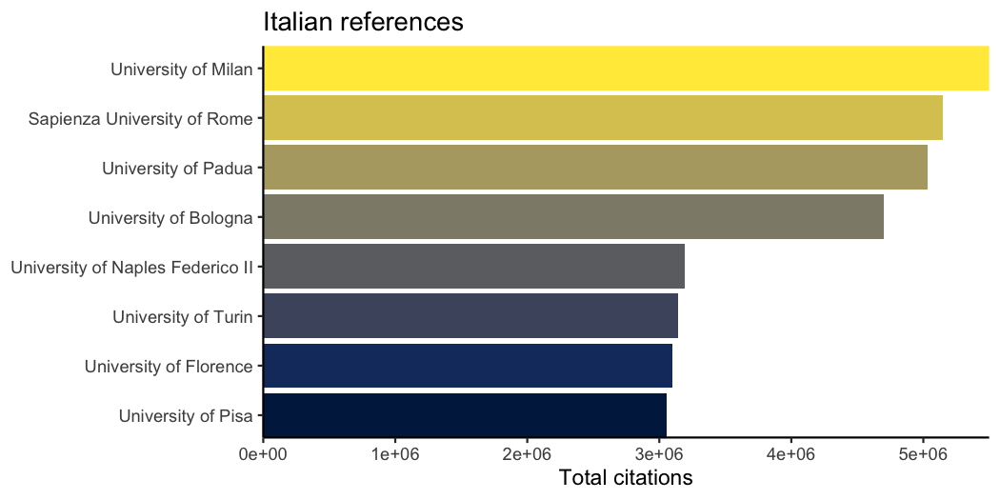
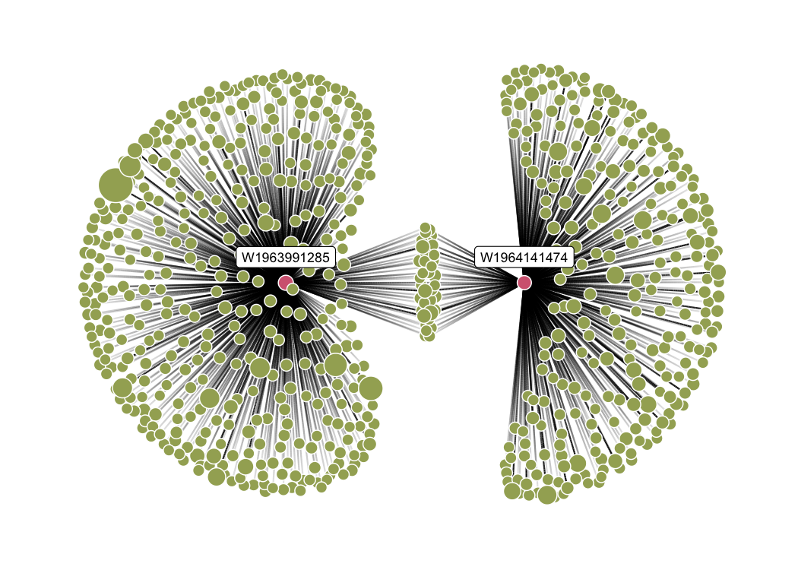

<!-- README.md is generated from README.Rmd. Please edit that file -->

# openalexR 

<!-- badges: start -->

[](https://github.com/ropensci/openalexR/actions/workflows/R-CMD-check.yaml)
[](https://lifecycle.r-lib.org/articles/stages.html#experimental)
[](https://CRAN.R-project.org/package=openalexR)
[](https://cran.r-project.org/package=openalexR)
[](https://app.codecov.io/gh/ropensci/openalexR?branch=main)
[](https://github.com/ropensci/software-review/issues/560)

<!-- badges: end -->

**openalexR** helps you interface with the
[OpenAlex](https://openalex.org) API to retrieve bibliographic
information about publications, authors, institutions, sources, funders,
publishers, topics and concepts with 5 main functions:

- `oa_fetch`: composes three functions below so the user can execute
  everything in one step, *i.e.*, `oa_query |> oa_request |> oa2df`

- `oa_query`: generates a valid query, written following the OpenAlex
  API syntax, from a set of arguments provided by the user.

- `oa_request`: downloads a collection of entities matching the query
  created by `oa_query` or manually written by the user, and returns a
  JSON object in a list format.

- `oa2df`: converts the JSON object in classical bibliographic
  tibble/data frame.

- `oa_random`: get random entity, *e.g.*, `oa_random("works")` gives a
  different work each time you run it

## 🙌 Support OpenAlex

If OpenAlex has helped you, consider writing a
[Testimonial](https://forms.monday.com/forms/4d5ad5a8e6a72ae31987a29118f1d437?r=use1)
which will help support the OpenAlex team and show that their work is
making a *real and necessary* impact.

## ⚙️ Setup

You can install the developer version of openalexR from
[GitHub](https://github.com) with:

``` r
install.packages("remotes")
remotes::install_github("ropensci/openalexR")
```

You can install the released version of openalexR from
[CRAN](https://CRAN.R-project.org) with:

``` r
install.packages("openalexR")
```

Before we go any further, we highly recommend you set `openalexR.mailto`
option so that your requests go to [the polite
pool](https://docs.openalex.org/how-to-use-the-api/rate-limits-and-authentication#the-polite-pool)
for faster response times. If you have OpenAlex Premium, you can add
your API key to the `openalexR.apikey` option as well. These lines best
go into `.Rprofile` with `file.edit("~/.Rprofile")`.

``` r
options(openalexR.mailto = "example@email.com")
options(openalexR.apikey = "EXAMPLE_APIKEY")
```

Alternatively, you can open `.Renviron` with `file.edit("~/.Renviron")`
and add:

    openalexR.mailto = example@email.com
    openalexR.apikey = EXAMPLE_APIKEY

``` r
library(openalexR)
library(dplyr)
library(ggplot2)
```

## 🌿 Examples

There are different
[filters](https://ropensci.github.io/openalexR/articles/Filters)/arguments
you can use in `oa_fetch`, depending on which
[entity](https://docs.openalex.org/#data) you’re interested in: works,
authors, sources, funders, institutions, or concepts. We show a few
examples below.

### 📚 Works

**Goal**: Download all information about a givens set of publications
(known DOIs).

Use `doi` as a [works
filter](https://ropensci.github.io/openalexR/articles/Filters.html#works):

``` r
works_from_dois <- oa_fetch(
  entity = "works",
  doi = c("10.1016/j.joi.2017.08.007", "https://doi.org/10.1007/s11192-013-1221-3"),
  verbose = TRUE
)
#> Requesting url: https://api.openalex.org/works?filter=doi%3A10.1016%2Fj.joi.2017.08.007%7Chttps%3A%2F%2Fdoi.org%2F10.1007%2Fs11192-013-1221-3
#> Getting 1 page of results with a total of 2 records...
```

We can view the output tibble/dataframe, `works_from_dois`,
interactively in RStudio or inspect it with base functions like `str` or
`head`. We also provide the experimental `show_works` function to
simplify the result (e.g., remove some columns, keep first/last author)
for easy viewing.

*Note*: the following table is wrapped in `knitr::kable()` to be
displayed nicely in this README, but you will most likely not need this
function.

``` r
# str(works_from_dois, max.level = 2)
# head(works_from_dois)
# show_works(works_from_dois)

works_from_dois |>
  show_works() |>
  knitr::kable()
```

| id          | display_name                                                              | first_author      | last_author        | so                      | url                                         | is_oa | top_concepts                          |
|:------------|:--------------------------------------------------------------------------|:------------------|:-------------------|:------------------------|:--------------------------------------------|:------|:--------------------------------------|
| W2755950973 | bibliometrix : An R-tool for comprehensive science mapping analysis       | Massimo Aria      | Corrado Cuccurullo | Journal of informetrics | <https://doi.org/10.1016/j.joi.2017.08.007> | FALSE | Workflow, Bibliometrics, Software     |
| W2038196424 | Coverage and adoption of altmetrics sources in the bibliometric community | Stefanie Haustein | Jens Terliesner    | Scientometrics          | <https://doi.org/10.1007/s11192-013-1221-3> | FALSE | Altmetrics, Bookmarking, Social media |

**Goal**: Download all works published by a set of authors (known
ORCIDs).

Use `author.orcid` as a filter (either canonical form with
<https://orcid.org/> or without will work):

``` r
works_from_orcids <- oa_fetch(
  entity = "works",
  author.orcid = c("0000-0001-6187-6610", "0000-0002-8517-9411"),
  verbose = TRUE
)
#> Requesting url: https://api.openalex.org/works?filter=author.orcid%3A0000-0001-6187-6610%7C0000-0002-8517-9411
#> Getting 2 pages of results with a total of 251 records...

works_from_orcids |>
  show_works() |>
  knitr::kable()
```

| id          | display_name                                                                                 | first_author      | last_author            | so                                     | url                                            | is_oa | top_concepts                          |
|:------------|:---------------------------------------------------------------------------------------------|:------------------|:-----------------------|:---------------------------------------|:-----------------------------------------------|:------|:--------------------------------------|
| W2755950973 | bibliometrix : An R-tool for comprehensive science mapping analysis                          | Massimo Aria      | Corrado Cuccurullo     | Journal of informetrics                | <https://doi.org/10.1016/j.joi.2017.08.007>    | FALSE | Workflow, Bibliometrics, Software     |
| W2741809807 | The state of OA: a large-scale analysis of the prevalence and impact of Open Access articles | Heather Piwowar   | Stefanie Haustein      | PeerJ                                  | <https://doi.org/10.7717/peerj.4375>           | TRUE  | Citation, License, Bibliometrics      |
| W2122130843 | Scientometrics 2.0: New metrics of scholarly impact on the social Web                        | Jason Priem       | Bradely H. Hemminger   | First Monday                           | <https://doi.org/10.5210/fm.v15i7.2874>        | FALSE | Bookmarking, Altmetrics, Social media |
| W2038196424 | Coverage and adoption of altmetrics sources in the bibliometric community                    | Stefanie Haustein | Jens Terliesner        | Scientometrics                         | <https://doi.org/10.1007/s11192-013-1221-3>    | FALSE | Altmetrics, Bookmarking, Social media |
| W2396414759 | The Altmetrics Collection                                                                    | Jason Priem       | Dario Taraborelli      | PloS one                               | <https://doi.org/10.1371/journal.pone.0048753> | TRUE  | Social media, Citation, Altmetrics    |
| W2041540760 | How and why scholars cite on Twitter                                                         | Jason Priem       | Kaitlin Light Costello | Proceedings of the ASIS annual meeting | <https://doi.org/10.1002/meet.14504701201>     | TRUE  | Citation, Conversation, Social media  |

**Goal**: Download all works that have been cited more than 50 times,
published between 2020 and 2021, and include the strings “bibliometric
analysis” or “science mapping” in the title. Maybe we also want the
results to be sorted by total citations in a descending order.

``` r
works_search <- oa_fetch(
  entity = "works",
  title.search = c("bibliometric analysis", "science mapping"),
  cited_by_count = ">50",
  from_publication_date = "2020-01-01",
  to_publication_date = "2021-12-31",
  options = list(sort = "cited_by_count:desc"),
  verbose = TRUE
)
#> Requesting url: https://api.openalex.org/works?filter=title.search%3Abibliometric%20analysis%7Cscience%20mapping%2Ccited_by_count%3A%3E50%2Cfrom_publication_date%3A2020-01-01%2Cto_publication_date%3A2021-12-31&sort=cited_by_count%3Adesc
#> Getting 2 pages of results with a total of 217 records...

works_search |>
  show_works() |>
  knitr::kable()
```

| id          | display_name                                                                                                                  | first_author        | last_author        | so                                        | url                                             | is_oa | top_concepts                                                  |
|:------------|:------------------------------------------------------------------------------------------------------------------------------|:--------------------|:-------------------|:------------------------------------------|:------------------------------------------------|:------|:--------------------------------------------------------------|
| W3160856016 | How to conduct a bibliometric analysis: An overview and guidelines                                                            | Naveen Donthu       | Weng Marc Lim      | Journal of business research              | <https://doi.org/10.1016/j.jbusres.2021.04.070> | TRUE  | Bibliometrics, Field (mathematics), Resource (disambiguation) |
| W3038273726 | Investigating the emerging COVID-19 research trends in the field of business and management: A bibliometric analysis approach | Surabhi Verma       | Anders Gustafsson  | Journal of business research              | <https://doi.org/10.1016/j.jbusres.2020.06.057> | TRUE  | Bibliometrics, Field (mathematics), Empirical research        |
| W2990450011 | Forty-five years of Journal of Business Research: A bibliometric analysis                                                     | Naveen Donthu       | Debidutta Pattnaik | Journal of business research              | <https://doi.org/10.1016/j.jbusres.2019.10.039> | FALSE | Publishing, Bibliometrics, Empirical research                 |
| W3001491100 | Software tools for conducting bibliometric analysis in science: An up-to-date review                                          | José A. Moral-Muñoz | Manuel J. Cobo     | ˜El œProfesional de la información          | <https://doi.org/10.3145/epi.2020.ene.03>       | TRUE  | Bibliometrics, Visualization, Set (abstract data type)        |
| W3044902155 | Financial literacy: A systematic review and bibliometric analysis                                                             | Kirti Goyal         | Satish Kumar       | International journal of consumer studies | <https://doi.org/10.1111/ijcs.12605>            | FALSE | Financial literacy, Content analysis, Citation                |
| W2990688366 | A bibliometric analysis of board diversity: Current status, development, and future research directions                       | H. Kent Baker       | Arunima Haldar     | Journal of business research              | <https://doi.org/10.1016/j.jbusres.2019.11.025> | FALSE | Diversity (politics), Ethnic group, Bibliometrics             |

### 🧑 Authors

**Goal**: Download author information when we know their ORCID.

Here, instead of `author.orcid` like earlier, we have to use `orcid` as
an argument. This may be a little confusing, but again, a different
entity (**authors** instead of **works**) requires a [different set of
filters](https://ropensci.github.io/openalexR/articles/Filters.html#authors).

``` r
authors_from_orcids <- oa_fetch(
  entity = "authors",
  orcid = c("0000-0001-6187-6610", "0000-0002-8517-9411")
)

authors_from_orcids |>
  show_authors() |>
  knitr::kable()
```

| id          | display_name | orcid               | works_count | cited_by_count | affiliation_display_name         | top_concepts                             |
|:------------|:-------------|:--------------------|------------:|---------------:|:---------------------------------|:-----------------------------------------|
| A5069892096 | Massimo Aria | 0000-0002-8517-9411 |         184 |           7530 | University of Naples Federico II | Statistics, Internal medicine, Pathology |
| A5023888391 | Jason Priem  | 0000-0001-6187-6610 |          69 |           2437 | OurResearch                      | World Wide Web, Library science, Law     |

**Goal**: Acquire information on the authors of this package.

We can use other filters such as `display_name` and `has_orcid`:

``` r
authors_from_names <- oa_fetch(
  entity = "authors",
  display_name = c("Massimo Aria", "Jason Priem"),
  has_orcid = TRUE
)
authors_from_names |>
  show_authors() |>
  knitr::kable()
```

| id          | display_name | orcid               | works_count | cited_by_count | affiliation_display_name         | top_concepts                             |
|:------------|:-------------|:--------------------|------------:|---------------:|:---------------------------------|:-----------------------------------------|
| A5069892096 | Massimo Aria | 0000-0002-8517-9411 |         184 |           7530 | University of Naples Federico II | Statistics, Internal medicine, Pathology |
| A5023888391 | Jason Priem  | 0000-0001-6187-6610 |          69 |           2437 | OurResearch                      | World Wide Web, Library science, Law     |

**Goal**: Download all authors’ records of scholars who work at the
[University of Naples Federico
II](https://explore.openalex.org/institutions/I71267560) (OpenAlex ID:
I71267560) and have published at least 500 publications.

Let’s first check how many records match the query, then download the
entire collection. We can do this by first defining a list of arguments,
then adding `count_only` (default `FALSE`) to this list:

``` r
my_arguments <- list(
  entity = "authors",
  last_known_institutions.id = "I71267560",
  works_count = ">499"
)

do.call(oa_fetch, c(my_arguments, list(count_only = TRUE)))
#>      count db_response_time_ms page per_page
#> [1,]    49                 123    1        1

if (do.call(oa_fetch, c(my_arguments, list(count_only = TRUE)))[1]>0){
do.call(oa_fetch, my_arguments) |>
  show_authors() |>
  knitr::kable()
}
```

| id          | display_name          | orcid               | works_count | cited_by_count | affiliation_display_name         | top_concepts                                         |
|:------------|:----------------------|:--------------------|------------:|---------------:|:---------------------------------|:-----------------------------------------------------|
| A5066548119 | D. della Volpe        | 0000-0001-8530-7447 |        1709 |          67469 | University of Naples Federico II | Quantum mechanics, Nuclear physics, Particle physics |
| A5032217427 | Nicola Longo          | 0000-0002-3677-1216 |        1160 |          12620 | University of Naples Federico II | Internal medicine, Genetics, Pathology               |
| A5015790909 | Davide Rossi          | 0000-0002-2837-1597 |        1031 |          23522 | University of Sydney             | Genetics, Internal medicine, Immunology              |
| A5076706548 | Salvatore Capozziello | 0000-0003-4886-2024 |         918 |          33561 | INFN Sezione di Napoli           | Quantum mechanics, Astronomy, Theoretical physics    |
| A5072318694 | G. Chiefari           | NA                  |         881 |          46310 | INFN Sezione di Napoli           | Quantum mechanics, Particle physics, Nuclear physics |
| A5023058736 | F. Fienga             | 0000-0001-5978-4952 |         855 |          16983 | University of Naples Federico II | Quantum mechanics, Nuclear physics, Particle physics |

## 🍒 Example analyses

**Goal**: track the popularity of *Biology* concepts over time.

We first download the records of all level-1 concepts/keywords that
concern over one million works:

``` r
library(gghighlight)
concept_df <- oa_fetch(
  entity = "concepts",
  level = 1,
  ancestors.id = "https://openalex.org/C86803240", # Biology
  works_count = ">1000000"
)

concept_df |>
  select(display_name, counts_by_year) |>
  tidyr::unnest(counts_by_year) |>
  filter(year < 2022) |>
  ggplot() +
  aes(x = year, y = works_count, color = display_name) +
  facet_wrap(~display_name) +
  geom_line(linewidth = 0.7) +
  scale_color_brewer(palette = "Dark2") +
  labs(
    x = NULL, y = "Works count",
    title = "Virology spiked in 2020."
  ) +
  guides(color = "none") +
  gghighlight(
    max(works_count) > 200000,
    min(works_count) < 400000,
    label_params = list(nudge_y = 10^5, segment.color = NA)
  )
#> label_key: display_name
```


**Goal**: Rank institutions in Italy by total number of citations.

We want download all records regarding Italian institutions
(country_code:it) that are classified as educational (type:education).
Again, we check how many records match the query then download the
collection:

``` r
italy_insts <- oa_fetch(
  entity = "institutions",
  country_code = "it",
  type = "education",
  verbose = TRUE
)
#> Requesting url: https://api.openalex.org/institutions?filter=country_code%3Ait%2Ctype%3Aeducation
#> Getting 2 pages of results with a total of 232 records...

italy_insts |>
  slice_max(cited_by_count, n = 8) |>
  mutate(display_name = forcats::fct_reorder(display_name, cited_by_count)) |>
  ggplot() +
  aes(x = cited_by_count, y = display_name, fill = display_name) +
  geom_col() +
  scale_fill_viridis_d(option = "E") +
  guides(fill = "none") +
  labs(
    x = "Total citations", y = NULL,
    title = "Italian references"
  ) +
  coord_cartesian(expand = FALSE)
```



And what do they publish on?

``` r
# The package wordcloud needs to be installed to run this chunk
# library(wordcloud)

concept_cloud <- italy_insts |>
  select(inst_id = id, x_concepts) |>
  tidyr::unnest(x_concepts) |>
  filter(level == 1) |>
  select(display_name, score) |>
  group_by(display_name) |>
  summarise(score = sum(score))

pal <- c("black", scales::brewer_pal(palette = "Set1")(5))
set.seed(1)
wordcloud::wordcloud(
  concept_cloud$display_name,
  concept_cloud$score,
  scale = c(2, .4),
  colors = pal
)
```


**Goal**: Visualize big journals’ topics.

We first download all records regarding journals that have published
more than 300,000 works, then visualize their scored concepts:

``` r
# The package ggtext needs to be installed to run this chunk
# library(ggtext)

jours_all <- oa_fetch(
  entity = "sources",
  works_count = ">200000",
  verbose = TRUE
)

jours <- jours_all |>
  filter(!is.na(x_concepts), type != "ebook platform") |>
  slice_max(cited_by_count, n = 9) |>
  distinct(display_name, .keep_all = TRUE) |>
  select(jour = display_name, x_concepts) |>
  tidyr::unnest(x_concepts) |>
  filter(level == 0) |>
  left_join(concept_abbrev, by = join_by(id, display_name)) |>
  mutate(
    abbreviation = gsub(" ", "<br>", abbreviation),
    jour = gsub("Journal of|Journal of the", "J.", gsub("\\(.*?\\)", "", jour))
  ) |>
  tidyr::complete(jour, abbreviation, fill = list(score = 0)) |>
  group_by(jour) |>
  mutate(
    color = if_else(score > 10, "#1A1A1A", "#D9D9D9"), # CCCCCC
    label = paste0("<span style='color:", color, "'>", abbreviation, "</span>")
  ) |>
  ungroup()

jours |>
  ggplot() +
  aes(fill = jour, y = score, x = abbreviation, group = jour) +
  facet_wrap(~jour) +
  geom_hline(yintercept = c(45, 90), colour = "grey90", linewidth = 0.2) +
  geom_segment(
    aes(x = abbreviation, xend = abbreviation, y = 0, yend = 100),
    color = "grey95"
  ) +
  geom_col(color = "grey20") +
  coord_polar(clip = "off") +
  theme_bw() +
  theme(
    plot.background = element_rect(fill = "transparent", colour = NA),
    panel.background = element_rect(fill = "transparent", colour = NA),
    panel.grid = element_blank(),
    panel.border = element_blank(),
    axis.text = element_blank(),
    axis.ticks.y = element_blank()
  ) +
  ggtext::geom_richtext(
    aes(y = 120, label = label),
    fill = NA, label.color = NA, size = 3
  ) +
  scale_fill_brewer(palette = "Set1", guide = "none") +
  labs(y = NULL, x = NULL, title = "Journal clocks")
```


## ❄️ Snowball search

The user can also perform *snowballing* with `oa_snowball`. Snowballing
is a literature search technique where the researcher starts with a set
of articles and find articles that cite or were cited by the original
set. `oa_snowball` returns a list of 2 elements: *nodes* and *edges*.
Similar to `oa_fetch`, `oa_snowball` finds and returns information on a
core set of articles satisfying certain criteria, but, unlike
`oa_fetch`, it also returns information the articles that cite and are
cited by this core set.

``` r
# The packages ggraph and tidygraph need to be installed to run this chunk
library(ggraph)
library(tidygraph)
#> 
#> Attaching package: 'tidygraph'
#> The following object is masked from 'package:stats':
#> 
#>     filter

snowball_docs <- oa_snowball(
  identifier = c("W1964141474", "W1963991285"),
  verbose = TRUE
)
#> Requesting url: https://api.openalex.org/works?filter=openalex%3AW1964141474%7CW1963991285
#> Getting 1 page of results with a total of 2 records...
#> Collecting all documents citing the target papers...
#> Requesting url: https://api.openalex.org/works?filter=cites%3AW1963991285%7CW1964141474
#> Getting 3 pages of results with a total of 533 records...
#> Collecting all documents cited by the target papers...
#> Requesting url: https://api.openalex.org/works?filter=cited_by%3AW1963991285%7CW1964141474
#> Getting 1 page of results with a total of 91 records...

ggraph(graph = as_tbl_graph(snowball_docs), layout = "stress") +
  geom_edge_link(aes(alpha = after_stat(index)), show.legend = FALSE) +
  geom_node_point(aes(fill = oa_input, size = cited_by_count), shape = 21, color = "white") +
  geom_node_label(aes(filter = oa_input, label = id), nudge_y = 0.2, size = 3) +
  scale_edge_width(range = c(0.1, 1.5), guide = "none") +
  scale_size(range = c(3, 10), guide = "none") +
  scale_fill_manual(values = c("#a3ad62", "#d46780"), na.value = "grey", name = "") +
  theme_graph() +
  theme(
    plot.background = element_rect(fill = "transparent", colour = NA),
    panel.background = element_rect(fill = "transparent", colour = NA),
    legend.position = "bottom"
  ) +
  guides(fill = "none")
#> Warning: The `scale_name` argument of `continuous_scale()` is deprecated as of ggplot2
#> 3.5.0.
#> This warning is displayed once every 8 hours.
#> Call `lifecycle::last_lifecycle_warnings()` to see where this warning was
#> generated.
#> Warning: Using the `size` aesthetic in this geom was deprecated in ggplot2 3.4.0.
#> ℹ Please use `linewidth` in the `default_aes` field and elsewhere instead.
#> This warning is displayed once every 8 hours.
#> Call `lifecycle::last_lifecycle_warnings()` to see where this warning was
#> generated.
```



## 🌾 N-grams

OpenAlex offers (limited) support for [fulltext
N-grams](https://docs.openalex.org/api-entities/works/get-n-grams#fulltext-coverage)
of Work entities (these have IDs starting with `"W"`). Given a vector of
work IDs, `oa_ngrams` returns a dataframe of N-gram data (in the
`ngrams` list-column) for each work.

``` r
ngrams_data <- oa_ngrams(
  works_identifier = c("W1964141474", "W1963991285"),
  verbose = TRUE
)

ngrams_data
#> # A tibble: 2 × 4
#>   id                               doi                              count ngrams
#>   <chr>                            <chr>                            <int> <list>
#> 1 https://openalex.org/W1964141474 https://doi.org/10.1016/j.conb.…  2733 <df>  
#> 2 https://openalex.org/W1963991285 https://doi.org/10.1126/science…  2338 <df>

lapply(ngrams_data$ngrams, head, 3)
#> [[1]]
#>                                        ngram ngram_count ngram_tokens
#> 1                 brain basis and core cause           2            5
#> 2                     cause be not yet fully           2            5
#> 3 include structural and functional magnetic           2            5
#>   term_frequency
#> 1   0.0006637902
#> 2   0.0006637902
#> 3   0.0006637902
#> 
#> [[2]]
#>                                          ngram ngram_count ngram_tokens
#> 1          intact but less accessible phonetic           1            5
#> 2 accessible phonetic representation in Adults           1            5
#> 3       representation in Adults with Dyslexia           1            5
#>   term_frequency
#> 1   0.0003756574
#> 2   0.0003756574
#> 3   0.0003756574

ngrams_data |>
  tidyr::unnest(ngrams) |>
  filter(ngram_tokens == 2) |>
  select(id, ngram, ngram_count) |>
  group_by(id) |>
  slice_max(ngram_count, n = 10, with_ties = FALSE) |>
  ggplot(aes(ngram_count, forcats::fct_reorder(ngram, ngram_count))) +
  geom_col(aes(fill = id), show.legend = FALSE) +
  facet_wrap(~id, scales = "free_y") +
  labs(
    title = "Top 10 fulltext bigrams",
    x = "Count",
    y = NULL
  )
```


`oa_ngrams` can sometimes be slow because the N-grams data can get
pretty big, but given that the N-grams are
`"cached via CDN"`\](<https://docs.openalex.org/api-entities/works/get-n-grams#api-endpoint>),
you may also consider parallelizing for this special case (`oa_ngrams`
does this automatically if you have `{curl} >= v5.0.0`).

## 💫 About OpenAlex


<div style="text-align: right">

Schema credits: [@dhimmel](https://github.com/dhimmel)

</div>

[OpenAlex](https://openalex.org) is a fully open catalog of the global
research system. It’s named after the ancient [Library of
Alexandria](https://en.wikipedia.org/wiki/Library_of_Alexandria). The
OpenAlex dataset describes scholarly entities and how those entities are
connected to each other. There are five types of entities:

- **Works** are papers, books, datasets, etc; they cite other works

- **Authors** are people who create works

- **Sources** are journals and repositories that host works

- **Institutions** are universities and other orgs that are affiliated
  with works (via authors)

- **Concepts** *tag* Works with a topic

## 🤝 Code of Conduct

Please note that this package is released with a [Contributor Code of
Conduct](https://ropensci.org/code-of-conduct/). By contributing to this
project, you agree to abide by its terms.

## 👓 Acknowledgements

Package hex was made with [Midjourney](https://www.midjourney.com/home/)
and thus inherits a [CC BY-NC 4.0
license](https://creativecommons.org/licenses/by-nc/4.0/legalcode).
