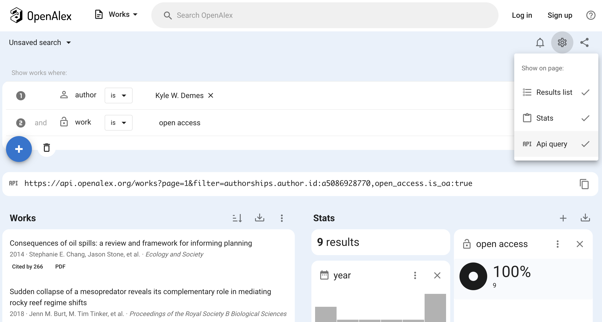

```{r, include = FALSE}
knitr::opts_chunk$set(
  collapse = TRUE,
  comment = "#>"
)
```

While `oa_fetch()` offers a convenient and flexible way of retrieving results from queries to the OpenAlex API, its defaults may not be best suited for heavier workflows that involve fetching records in the magnitude of tens or hundreds of thousands of entities.

Optimizing the performance of such large queries benefits greatly from being intentional and specific about what kinds of information you care about, and making assumptions that let you safely take shortcuts around the defaults.

This vignette discusses three strategies for for optimizing performance of large queries:

-   The parameter `options = list(select = ...)` in `oa_fetch()`
-   The argument `output = "list"` in `oa_fetch()`
-   The function `oa_generate()`

```{r setup, message=FALSE}
library(openalexR)
library(dplyr)
```

## The `select` strategy

The `options` argument of `oa_fetch()` specifies a list of additional parameters to add to the query, such as `select`, `sort`, `sample`, and `seed`.
Of these, `select` can be used to specify which fields of the entities are to be returned by OpenAlex.
By specifying only the kinds of information about entities that you care about, you can reduce the overall size of the query result, which will in turn speed up the fetching of the raw JSON and its conversion to a data frame.

For example, suppose that we are looking for a sample of works from the [Topic](https://docs.openalex.org/api-entities/topics) of [Language Development and Acquisition in Children](https://openalex.org/topics/T10730) (`"T10730"`).

```{r}
language_development <- oa_fetch(
  entity = "topics",
  search = "Language Development and Acquisition in Children"
)[1,1:2]
language_development
```

To sample some papers from this topic, we can use the `topics.id` [filter](https://docs.ropensci.org/openalexR/articles/Filters.html) and set `options = list(sample = 5, seed = 1)` to return a random set of five [Works](https://docs.openalex.org/api-entities/works) entities with a reproducible seed:

```{r}
oa_fetch(
  entity = "works",
  topics.id = language_development$id,
  options = list(sample = 5, seed = 1)
) %>% 
  show_works()
```

In OpenAlex, entities have a set of **fields** which represent various information about them.
These are typically returned as data frame columns by `oa_fetch()`, and the full list of fields can be found in the API documentation for each entity.
For example, [the fields in a Works object](https://docs.openalex.org/api-entities/works/work-object) contain information such as `id`, `display_name`, `authorships`, and so on.

If we only cared about the above three fields from our sample of papers, we can simplify specify those fields in the `select` parameters of the `options` list of arguments:

```{r}
oa_fetch(
  entity = "works",
  topics.id = language_development$id,
  options = list(sample = 5, seed = 1,
                 select = c("id", "display_name", "authorships"))
)
```

This returns the scalar fields `id` and `display_name` in their appropriate data types (character) in the dataframe.
Additionally, the `authorships` field has been further processed as a list-column of data frames, to fit nicely into the "tidy" data frame structure.

Specifying the desired fields up front in this way is not only convenient but also more performant, as there will be less data for `oa_fetch()` to process.

## The `output = "list"` strategy

By default, `oa_fetch()` uses `output = "tibble"`, which returns a processed `tibble` data frame of the results.
In such cases, the JSON response from OpenAlex is first converted to an R list, then a data frame via `oa2df()`, which calls the appropriate conversion implementation depending on the type of entity being processed (e.g., `works2df()` for Works entities).

A lot of care goes into `oa2df()` to return a compact, tidy-data representation of query results.
But these operations can become a bottleneck to performance at scale, and so sometimes you may want to opt out of this automatic data frame conversion.

To do so in `oa_fetch()`, you can set `output = "list"`, which will simply return the R list corresponding to the JSON response.

```{r}
output_list <- oa_fetch(
  entity = "works",
  topics.id = language_development$id,
  options = list(sample = 5, seed = 1),
  output = "list"
)
str(output_list, max.level = 1)
```

The list output can get quite unruly — each record contains dozens of fields, some of which may be multiply nested.
Moreover, some records may have missing or incomplete fields, so extra care must be taken with the `output = "list"` approach.

One advantage of returning the output as a list is that you can always come back to process them as data frames later.
Instead of retrieving *and* converting the results simultaneously, which may stress `oa_fetch()` for large queries, you can retrieve all the results first *and then* convert them after the fact.

In our case, the Works entities can be processed with `works2df()` (or more generally, `oa2df(entity = "works")`), which returns a data frame identical to what we saw at the start with the default `output = "tibble"`:

```{r}
works2df(output_list) %>% 
  show_works()
```

Additionally, opting out of the data frame conversion also means that you can use your own preferred implementation for converting the list output.
This can be a very powerful optimization strategy when combined with the `select` option.

For example, if you know that you are only selecting scalar fields, you can very quickly convert the list output into a tidy data using more powerful tools like `data.table::rbindlist()` or even just `rbind()`:

```{r}
oa_fetch(
  entity = "works",
  topics.id = language_development$id,
  options = list(sample = 5, seed = 1,
                 select = c("id", "display_name", "cited_by_count")),
  output = "list"
) %>% 
  do.call(rbind.data.frame, .) %>% 
  as_tibble()
```

## The `oa_generate()` strategy

If your code still seems slow, it is possible that you may have run out of memory (especially when you do a snowball search like with `oa_snowball`).
In such cases, it might help to chunk your work and save the output of each step, then piece them back together later in a different session/program.[^1]

[^1]: Determining whether memory is sufficient to store all records at the beginning is not straightforward.
    We believe the (power) user should be in charge of this step, combining \`count_only = TRUE\` with their knowledge of their machine's RAM specs to determine whether they should write out the stepwise results themselves.
    Related GH issues: [here](https://github.com/ropensci/openalexR/issues/129#issuecomment-1642664363) and [here](https://github.com/ropensci/openalexR/issues/95#issuecomment-1513964112).

The `oa_generate()` function is a lower-level function that allows you to process one record at a time.
This way, you can process records in batches of, say, 1000 records, and write them out to disk as you go along.[^2]

[^2]: Quick note: For the case without `group_by`, setting `verbose = TRUE` when you call `oar()` for the first time will give the total number of records in the message.
    With `group_by`, unfortunately we don't have a way to know the total until we query until exhausted.
    Also, you will need to have the R package [**coro**](https://github.com/r-lib/coro) installed to use `oa_generate()` (`install.packages("coro")`).

In the example below, we show how `oa_generate()` works when we want to find all the works that cite [W1160808132](https://openalex.org/works/W1160808132).

```{r}
query_url <- "https://api.openalex.org/works?filter=cites%3AW1160808132"
oar <- oa_generate(query_url, verbose = TRUE)
p1 <- oar() # record 1
p2 <- oar() # record 2
p3 <- oar() # record 3
head(p1)
head(p3)
```

As you see, each record returned by `oa_generate` is a list of fields belonging to a work, parsed from the JSON response from OpenAlex.
You can process these records as you see fit, such as writing them out as *.rds* files in batches of 100 records.

```{r eval=FALSE}
query_url <- "https://api.openalex.org/works?filter=cites%3AW1160808132"
oar <- oa_generate(query_url)
n <- 100
recs <- vector("list", n)
i <- 0

coro::loop(for (x in oar) {
  j <- i %% n + 1
  recs[[j]] <- x
  if (j == n) {
    saveRDS(recs, file.path(tempdir(), sprintf("rec-%s.rds", i %/% n)))
    recs <- vector("list", n) # reset recs
  }
  i <- i + 1
})

dir(tempdir(), pattern = "rec-\\d.rds$")
#> [1] "rec-0.rds" "rec-1.rds" "rec-2.rds" "rec-3.rds"
```

### Tips on generating the query URL to the OpenAlex API

To build your query, you can use `oa_query()` and carefully read the [API documentation](https://docs.openalex.org/) to see what fields/filters are available.
For example, I know `cites` is a filter we can use:

```{r}
oa_query(entity = "works", cites = "W1160808132")
```

However, you might find it helpful to use the OpenAlex web interface to build the query [interactively](https://openalex.org/works?page=1&filter=authorships.author.id%3Aa5086928770,open_access.is_oa%3Atrue&view=list,report,api).
Make sure you select the Gear icon on the right and toggle on "Api query".


